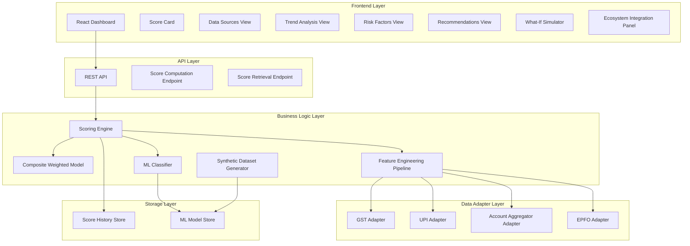

# Design Document: MSME Financial Health Score System

## Overview

The MSME Financial Health Score system is a web-based application that evaluates the financial health of Micro, Small, and Medium Enterprises using alternate data sources. The system aggregates data from GST, UPI transactions, Account Aggregator framework, and EPFO records to compute a comprehensive financial health score (0-100) with risk band classification (Low/Medium/High).

### Key Design Principles

1. **Modularity**: Data adapters, feature engineering, and scoring engines are loosely coupled components
2. **Explainability**: ML predictions are accompanied by SHAP values to provide transparency
3. *liver explainable risk classifications using SHAP values
- Enable trend analysis over 6-month historical periods
- Simulate ecosystem integration with Account Aggregator, ULI, and OCEN
- Provide what-if analysis for exploring improvement scenarios

### Key Features

- **Authentication**: Supabase Auth with email/password, session persistence, JWT tokens
- **Multi-source data integration**: GST, UPI, Account Aggregator, EPFO adapters
- **Dual scoring approach**: Composite weighted model + ML classifier
- **Explainability**: SHAP values for understanding risk drivers
- **Interactive dashboard**: 7 specialized views for comprehensive analysis
- **What-if simulator**: Real-time score recalculation with feature adjustments
- **Ecosystem integration**: Simulated AA consent, ULI publishing, OCEN lender matching
- **Historical tracking**: 6-month score history with trend visualization

## Architecture

### System Architecture




### Architecture Layers

**Frontend Layer (React)**
- Single-page application with authentication gates (login/signup screens)
- 7 dashboard views accessible only to authenticated users
- Protected routes using Supabase Auth session validation
- Responsive design supporting desktop (>1024px), tablet (768-1024px), mobile (<768px)
- Real-time score visualization and what-if simulation
- Client-side state management for UI interactions and auth session

**API Layer (REST)**
- All endpoints protected with JWT authentication middleware
- Validates Supabase Auth tokens on every request
- Returns 401 Unauthorized for missing or invalid tokens
- Score computation endpoint (POST /api/scores)
- Score retrieval endpoint (GET /api/scores/:msmeId)
- Historical data query endpoint (GET /api/scores/:msmeId/history)
- Error handling and partial data support

**Business Logic Layer**
- Scoring Engine: Orchestrates feature engineering and score computation
- Composite Weighted Model: Sector-specific weighted scoring
- ML Classifier: Risk classification with SHAP explainability
- Feature Engineering Pipeline: Transforms raw data into normalized features
- Synthetic Dataset Generator: Creates training data for ML classifier

**Data Adapter Layer**
- Standardized interface for all data sources
- Mock implementations for development/testing
- Production mode configuration support
- Error handling and timeout management

**Storage Layer**
- Score History Store: Persistent storage for score records (6-12 month retention)
- ML Model Store: Trained classifier and SHAP explainer persistence

### Technology Stack

- **Frontend**: React 18+, Supabase Auth JS client, Chart.js/Recharts for visualization, Axios for API calls
- **Backend**: Python/Flask with Supabase Auth JWT verification
- **Authentication**: Supabase Auth (email/password, JWT tokens, session management)
- **Database**: Supabase (PostgreSQL) for score history and built-in auth tables
- **ML Framework**: scikit-learn for classification, SHAP library for explainability
- **Mock Data**: Faker.js or equivalent for realistic synthetic data generation

### Authentication Flow

**User Registration Flow**:
1. User navigates to `/signup`
2. User submits email and password
3. Supabase Auth creates user account and sends confirmation email (optional)
4. User is automatically signed in with session token
5. Frontend stores session and redirects to dashboard

**User Login Flow**:
1. User navigates to `/login` (or is redirected if accessing protected route)
2. User submits email and password
3. Supabase Auth validates credentials and returns JWT session
4. Frontend stores session in memory and localStorage
5. User is redirected to `/dashboard` (MSME search screen)

**Session Management**:
- Supabase Auth automatically refreshes JWT tokens before expiration
- Session persists across browser refreshes via localStorage
- Invalid/expired tokens trigger redirect to login screen

**API Request Flow**:
1. Frontend includes JWT token in `Authorization: Bearer <token>` header
2. Flask middleware validates token with Supabase
3. If valid: Request proceeds to route handler
4. If invalid: Returns 401 Unauthorized response
5. Frontend detects 401 and redirects to login

**Logout Flow**:
1. User clicks logout button
2. Frontend calls Supabase signOut()
3. Session cleared from localStorage
4. User redirected to `/login`


## Components and Interfaces

### Authentication Components

#### Supabase Auth Integration

```typescript
interface AuthService {
  // Sign up new user with email and password
  signUp(email: string, password: string): Promise<AuthResponse>;
  
  // Sign in existing user
  signIn(email: string, password: string): Promise<AuthResponse>;
  
  // Sign out current user
  signOut(): Promise<void>;
  
  // Get current session
  getSession(): Promise<Session | null>;
  
  // Listen for auth state changes
  onAuthStateChange(callback: (event: string, session: Session | null) => void): () => void;
}

interface AuthResponse {
  user: User | null;
  session: Session | null;
  error: Error | null;
}

interface User {
  id: string;
  email: string;
  created_at: string;
}

interface Session {
  access_token: string; // JWT token
  refresh_token: string;
  expires_at: number;
  user: User;
}
```

#### Protected Route Wrapper

```typescript
interface ProtectedRouteProps {
  children: React.ReactNode;
}

// Wraps routes requiring authentication
// Redirects to /login if no valid session
// Automatically refreshes expired tokens
function ProtectedRoute({ children }: ProtectedRouteProps): React.ReactElement {
  const session = useSession();
  
  if (!session) {
    return <Navigate to="/login" replace />;
  }
  
  return <>{children}</>;
}
```

#### Auth Context Provider

```typescript
interface AuthContextValue {
  user: User | null;
  session: Session | null;
  loading: boolean;
  signIn: (email: string, password: string) => Promise<void>;
  signUp: (email: string, password: string) => Promise<void>;
  signOut: () => Promise<void>;
}

// Provides auth state throughout the app
// Handles automatic token refresh
// Persists session across page reloads
function AuthProvider({ children }: { children: React.ReactNode }): React.ReactElement;
```

#### Backend JWT Verification Middleware

```python
from functools import wraps
from flask import request, jsonify
import jwt
from supabase import create_client

def require_auth(f):
    """
    Decorator for Flask routes requiring authentication.
    Validates JWT token from Authorization header.
    Returns 401 if token is missing or invalid.
    """
    @wraps(f)
    def decorated_function(*args, **kwargs):
        auth_header = request.headers.get('Authorization')
        
        if not auth_header or not auth_header.startswith('Bearer '):
            return jsonify({'success': False, 'error': 'Missing or invalid authorization header'}), 401
        
        token = auth_header.split(' ')[1]
        
        try:
            # Verify JWT token with Supabase
            supabase = create_client(SUPABASE_URL, SUPABASE_KEY)
            user = supabase.auth.get_user(token)
            
            if not user:
                return jsonify({'success': False, 'error': 'Invalid token'}), 401
            
            # Attach user to request context
            request.user = user
            
            return f(*args, **kwargs)
        except Exception as e:
            return jsonify({'success': False, 'error': 'Token verification failed'}), 401
    
    return decorated_function

# Usage:
# @app.route('/api/scores', methods=['POST'])
# @require_auth
# def compute_score():
#     user = request.user
#     # ... implementation
```

### Data Adapter Components

#### Base Data Adapter Interface

```typescript
interface DataAdapter {
  // Retrieves raw data from external source
  fetchData(identifier: string): Promise<RawData>;
  
  // Normalizes raw data to standard format
  normalizeData(rawData: RawData): Promise<NormalizedData>;
  
  // Sets adapter to mock or production mode
  setMode(mode: 'mock' | 'production'): void;
  
  // Returns adapter status and last fetch timestamp
  getStatus(): AdapterStatus;
}

interface AdapterStatus {
  isHealthy: boolean;
  lastFetchTimestamp: Date | null;
  errorMessage: string | null;
}

interface NormalizedData {
  source: 'GST' | 'UPI' | 'AA' | 'EPFO';
  fetchedAt: Date;
  data: Record<string, any>;
}
```

#### GST Adapter

```typescript
interface GSTAdapter extends DataAdapter {
  fetchData(gstNumber: string): Promise<GSTRawData>;
  normalizeData(rawData: GSTRawData): Promise<GSTNormalizedData>;
}

interface GSTNormalizedData extends NormalizedData {
  data: {
    annualRevenue: number;
    filingFrequency: number; // returns filed / expected returns
    complianceStatus: 'compliant' | 'non-compliant' | 'partial';
    revenueGrowthRate: number; // year-over-year percentage
    lastFilingDate: Date;
  };
}
```

#### UPI Adapter

```typescript
interface UPIAdapter extends DataAdapter {
  fetchData(upiId: string): Promise<UPIRawData>;
  normalizeData(rawData: UPIRawData): Promise<UPINormalizedData>;
}

interface UPINormalizedData extends NormalizedData {
  data: {
    monthlyTransactionVolume: number;
    transactionFrequency: number; // transactions per month
    averageTransactionValue: number;
    inboundOutboundRatio: number; // inbound / outbound
    transactionGrowthRate: number; // month-over-month
  };
}
```

#### Account Aggregator Adapter

```typescript
interface AAAdapter extends DataAdapter {
  fetchData(consentToken: string): Promise<AARawData>;
  normalizeData(rawData: AARawData): Promise<AANormalizedData>;
}

interface AANormalizedData extends NormalizedData {
  data: {
    averageBalance: number;
    minimumBalance: number;
    creditDebitRatio: number; // credits / debits
    liquidityRatio: number; // current balance / average monthly outflow
    overdraftFrequency: number; // times balance went negative
  };
}
```

#### EPFO Adapter


```typescript
interface EPFOAdapter extends DataAdapter {
  fetchData(establishmentId: string): Promise<EPFORawData>;
  normalizeData(rawData: EPFORawData): Promise<EPFONormalizedData>;
}

interface EPFONormalizedData extends NormalizedData {
  data: {
    employeeCount: number;
    monthlyContributionAmount: number;
    contributionRegularity: number; // paid contributions / expected contributions
    employeeGrowthRate: number; // quarter-over-quarter
    averageWagePerEmployee: number;
  };
}
```

### Feature Engineering Pipeline

```typescript
interface FeatureEngineeringPipeline {
  // Transforms raw data from all adapters into scoring features
  computeFeatures(dataMap: Map<string, NormalizedData>): Promise<EngineeredFeatures>;
  
  // Applies imputation strategy for missing data
  imputeMissingFeatures(features: Partial<EngineedFeatures>): EngineedFeatures;
  
  // Normalizes features to 0-1 scale
  normalizeFeatures(features: EngineedFeatures): NormalizedFeatures;
}

interface EngineedFeatures {
  revenueStability: number; // coefficient of variation of revenue
  transactionVelocity: number; // composite of volume and frequency
  liquidityRatio: number; // ability to cover short-term obligations
  employmentConsistency: number; // stability of employee count and contributions
  complianceScore: number; // GST filing regularity
  growthIndicator: number; // composite of revenue, transaction, employee growth
}

interface NormalizedFeatures {
  revenueStability: number; // 0-1
  transactionVelocity: number; // 0-1
  liquidityRatio: number; // 0-1
  employmentConsistency: number; // 0-1
  complianceScore: number; // 0-1
  growthIndicator: number; // 0-1
}
```

### Scoring Engine

```typescript
interface ScoringEngine {
  // Computes comprehensive score using both models
  computeScore(msmeId: string, sector: MSMESector): Promise<ScoreResult>;
  
  // Orchestrates data retrieval and feature engineering
  gatherData(msmeId: string): Promise<Map<string, NormalizedData>>;
  
  // Computes score using available data with partial failure handling
  computeWithPartialData(features: Partial<EngineedFeatures>, sector: MSMESector): ScoreResult;
}

interface ScoreResult {
  msmeId: string;
  compositeScore: number; // 0-100
  mlRiskBand: RiskBand;
  mlConfidence: RiskConfidence;
  shapValues: ShapValues;
  features: NormalizedFeatures;
  missingDataSources: string[];
  computedAt: Date;
}

type RiskBand = 'Low' | 'Medium' | 'High';

interface RiskConfidence {
  low: number;
  medium: number;
  high: number;
}

interface ShapValues {
  revenueStability: number;
  transactionVelocity: number;
  liquidityRatio: number;
  employmentConsistency: number;
  complianceScore: number;
  growthIndicator: number;
}
```


### Composite Weighted Model

```typescript
interface CompositeWeightedModel {
  // Computes weighted score based on sector configuration
  computeScore(features: NormalizedFeatures, sector: MSMESector): number;
  
  // Handles missing features by weight adjustment
  adjustWeights(availableFeatures: string[], weights: SectorWeights): SectorWeights;
  
  // Loads sector-specific weight configuration
  getSectorWeights(sector: MSMESector): SectorWeights;
}

type MSMESector = 'Trader' | 'Manufacturer' | 'Services';

interface SectorWeights {
  revenueStability: number;
  transactionVelocity: number;
  liquidityRatio: number;
  employmentConsistency: number;
  complianceScore: number;
  growthIndicator: number;
}

// Default weight configurations
const DEFAULT_WEIGHTS: Record<MSMESector, SectorWeights> = {
  Trader: {
    revenueStability: 0.25,
    transactionVelocity: 0.35,
    liquidityRatio: 0.30,
    employmentConsistency: 0.10,
    complianceScore: 0.0, // Rolled into revenueStability
    growthIndicator: 0.0  // Rolled into transactionVelocity
  },
  Manufacturer: {
    revenueStability: 0.35,
    transactionVelocity: 0.20,
    liquidityRatio: 0.25,
    employmentConsistency: 0.20,
    complianceScore: 0.0,
    growthIndicator: 0.0
  },
  Services: {
    revenueStability: 0.30,
    transactionVelocity: 0.25,
    liquidityRatio: 0.20,
    employmentConsistency: 0.25,
    complianceScore: 0.0,
    growthIndicator: 0.0
  }
};
```

#### Sector Weight Tables

The composite weighted model applies different feature weights based on the MSME's sector to reflect the varying importance of financial health dimensions across business types. The following tables show the weight distribution for each sector:

**Trader Sector Weights**

| Feature Dimension | Weight | Rationale |
|------------------|--------|-----------|
| Revenue Stability | 25% | Moderate importance - traders have more variable revenue patterns |
| Transaction Velocity | 35% | Highest importance - transaction volume is core to trading businesses |
| Liquidity Ratio | 30% | High importance - traders need strong working capital for inventory |
| Employment Consistency | 10% | Lower importance - traders typically have smaller, more variable workforces |

**Manufacturer Sector Weights**

| Feature Dimension | Weight | Rationale |
|------------------|--------|-----------|
| Revenue Stability | 35% | Highest importance - manufacturing requires stable revenue for capital investments |
| Transaction Velocity | 20% | Lower importance - manufacturers have fewer but larger transactions |
| Liquidity Ratio | 25% | Moderate importance - needed for raw materials and operations |
| Employment Consistency | 20% | Significant importance - manufacturing requires stable workforce |

**Services Sector Weights**

| Feature Dimension | Weight | Rationale |
|------------------|--------|-----------|
| Revenue Stability | 30% | High importance - service businesses need consistent revenue streams |
| Transaction Velocity | 25% | Moderate importance - services have regular but smaller transactions |
| Liquidity Ratio | 20% | Moderate importance - services have lower working capital needs |
| Employment Consistency | 25% | High importance - service quality depends on workforce stability |

**Note**: Compliance Score and Growth Indicator are conceptually incorporated into the primary dimensions (Revenue Stability and Transaction Velocity respectively) and carry 0% explicit weight to avoid double-counting.

### ML Classifier

```typescript
interface MLClassifier {
  // Predicts risk band for given features
  predict(features: NormalizedFeatures): Promise<MLPrediction>;
  
  // Computes SHAP values for explainability
  explainPrediction(features: NormalizedFeatures): Promise<ShapValues>;
  
  // Trains classifier on synthetic dataset
  train(dataset: TrainingDataset): Promise<void>;
  
  // Loads trained model from storage
  loadModel(): Promise<void>;
}

interface MLPrediction {
  riskBand: RiskBand;
  confidence: RiskConfidence;
}

interface TrainingDataset {
  features: NormalizedFeatures[];
  labels: RiskBand[];
}
```

### API Layer

```typescript
// POST /api/scores
interface ScoreComputationRequest {
  msmeId: string;
  gstNumber: string;
  upiId: string;
  aaConsentToken: string;
  epfoEstablishmentId: string;
  sector: MSMESector;
}

interface ScoreComputationResponse {
  success: boolean;
  data?: ScoreResult;
  error?: string;
}

// GET /api/scores/:msmeId
interface ScoreRetrievalResponse {
  success: boolean;
  data?: ScoreResult;
  error?: string;
}

// GET /api/scores/:msmeId/history?startDate=YYYY-MM-DD&endDate=YYYY-MM-DD
interface ScoreHistoryResponse {
  success: boolean;
  data?: ScoreHistoryRecord[];
  error?: string;
}

interface ScoreHistoryRecord {
  msmeId: string;
  compositeScore: number;
  riskBand: RiskBand;
  computedAt: Date;
}
```


### Dashboard Components

#### Score Card Component

```typescript
interface ScoreCardProps {
  score: number;
  riskBand: RiskBand;
  computedAt: Date;
}

// Displays:
// - Large numeric score (0-100)
// - Gauge visualization with color-coded zones
// - Risk band badge with color coding (green/yellow/red)
// - Timestamp of computation
```

#### Data Sources View Component

```typescript
interface DataSourcesViewProps {
  gstData: GSTNormalizedData;
  upiData: UPINormalizedData;
  aaData: AANormalizedData;
  epfoData: EPFONormalizedData;
  errors: Map<string, string>;
}

// Displays:
// - 4 panels (GST, UPI, AA, EPFO)
// - Key metrics from each source
// - Data freshness timestamps
// - Error indicators for failed sources
```

#### Trend Analysis View Component

```typescript
interface TrendAnalysisViewProps {
  history: ScoreHistoryRecord[];
  dateRange: { start: Date; end: Date };
  onDateRangeChange: (range: { start: Date; end: Date }) => void;
}

// Displays:
// - Line chart of scores over time
// - Color-coded risk band segments
// - Date range selector
// - Minimum 6 months data when available
```

#### Risk Factors View Component

```typescript
interface RiskFactorsViewProps {
  shapValues: ShapValues;
  features: NormalizedFeatures;
}

// Displays:
// - Horizontal bar chart of SHAP values
// - Features ranked by absolute contribution
// - Color coding: green (positive), red (negative)
// - Feature values alongside SHAP values
```

#### Recommendations View Component

```typescript
interface RecommendationsViewProps {
  shapValues: ShapValues;
  features: NormalizedFeatures;
  riskBand: RiskBand;
}

interface Recommendation {
  category: 'revenue' | 'liquidity' | 'compliance' | 'employment';
  title: string;
  description: string;
  priority: 'high' | 'medium' | 'low';
}

// Generates 3-5 recommendations based on:
// - Top negative SHAP values (for Medium/High risk)
// - Feature values below thresholds
// - Categorized by improvement area
```

#### What-If Simulator Component

```typescript
interface WhatIfSimulatorProps {
  originalFeatures: NormalizedFeatures;
  originalScore: number;
  originalRiskBand: RiskBand;
  sector: MSMESector;
  onSimulate: (adjustedFeatures: NormalizedFeatures) => void;
}

interface SimulationResult {
  simulatedScore: number;
  simulatedRiskBand: RiskBand;
  scoreDelta: number;
  riskBandChanged: boolean;
}

// Provides:
// - Sliders/inputs for adjusting key features
// - Real-time score recalculation (<100ms)
// - Delta display (original vs simulated)
// - Reset button to restore original values
```

#### Ecosystem Integration Panel Component


```typescript
interface EcosystemIntegrationPanelProps {
  riskBand: RiskBand;
  score: number;
}

interface ConsentSimulation {
  status: 'pending' | 'approved' | 'rejected';
  consentToken?: string;
  timestamp: Date;
}

interface ULIPublishSimulation {
  status: 'success' | 'failure';
  transactionId?: string;
  timestamp: Date;
}

interface LenderMatch {
  name: string;
  productType: string;
  interestRate: string;
  maxAmount: string;
}

// Simulates:
// - AA consent request/approval flow (<500ms)
// - ULI score publishing with mock transaction ID
// - OCEN lender matching (2-3 lenders based on risk band)
// - Prime rates for Low risk, higher rates for Medium/High
```

## Data Models

### Score History Persistence Strategy

**Storage Technology**: PostgreSQL (recommended)

PostgreSQL is the recommended storage solution for score history due to:
- Strong support for time-series queries with efficient indexing
- JSONB data type for flexible storage of features and SHAP values
- Robust data integrity and ACID compliance
- Excellent performance for range queries and aggregations
- Native support for retention policies via partitioning

**Retention Policy**:
- **Active Storage**: Minimum 6 months of score history per MSME
- **Archive Threshold**: Records older than 12 months are archived to cold storage
- **Archive Strategy**: Use table partitioning by month for efficient archival
- **Query Performance**: Composite index on (msme_id, computed_at DESC) ensures fast retrieval

**Index Strategy**:
- Primary index: `idx_msme_computed (msme_id, computed_at DESC)` - optimizes trend queries
- Secondary index: `idx_computed_at (computed_at)` - optimizes date-range queries
- JSONB GIN indexes on features and shap_values for filtering by specific feature values (optional)

### Database Schema

#### Score History Table

```sql
CREATE TABLE score_history (
  id UUID PRIMARY KEY DEFAULT gen_random_uuid(),
  msme_id VARCHAR(100) NOT NULL,
  composite_score DECIMAL(5,2) NOT NULL CHECK (composite_score >= 0 AND composite_score <= 100),
  risk_band VARCHAR(10) NOT NULL CHECK (risk_band IN ('Low', 'Medium', 'High')),
  ml_confidence_low DECIMAL(5,4),
  ml_confidence_medium DECIMAL(5,4),
  ml_confidence_high DECIMAL(5,4),
  features JSONB NOT NULL,
  shap_values JSONB NOT NULL,
  missing_sources TEXT[],
  computed_at TIMESTAMP NOT NULL DEFAULT NOW(),
  sector VARCHAR(20) NOT NULL,
  
  INDEX idx_msme_computed (msme_id, computed_at DESC),
  INDEX idx_computed_at (computed_at)
);

-- Retention policy: 
-- - Minimum 6 months of data MUST be retained for Trend Analysis View
-- - Recommended retention: 12 months active, then archive
-- - Archive mechanism: Move records older than 12 months to score_history_archive table or cold storage

-- Storage Technology: PostgreSQL 14+ (recommended)
-- - Native JSONB support for flexible feature and SHAP value storage
-- - Excellent time-series query performance with proper indexing
-- - Table partitioning support for efficient archival
-- - ACID compliance for score history integrity

-- Partitioning strategy (recommended for large datasets):
-- Partition by computed_at month for efficient time-range queries and archival
-- Example: CREATE TABLE score_history_2024_01 PARTITION OF score_history 
--          FOR VALUES FROM ('2024-01-01') TO ('2024-02-01');

-- Archive enforcement (example with PostgreSQL pg_cron):
-- SELECT cron.schedule('archive-old-scores', '0 2 * * 0', 
--   'INSERT INTO score_history_archive SELECT * FROM score_history WHERE computed_at < NOW() - INTERVAL ''12 months'';
--    DELETE FROM score_history WHERE computed_at < NOW() - INTERVAL ''12 months'';');
```

#### Sector Weight Configuration Table

```sql
CREATE TABLE sector_weights (
  id UUID PRIMARY KEY DEFAULT gen_random_uuid(),
  sector VARCHAR(20) NOT NULL UNIQUE,
  weights JSONB NOT NULL,
  updated_at TIMESTAMP NOT NULL DEFAULT NOW()
);

-- Example weights JSONB:
-- {
--   "revenueStability": 0.25,
--   "transactionVelocity": 0.35,
--   "liquidityRatio": 0.30,
--   "employmentConsistency": 0.10
-- }
```

### Feature Engineering Algorithms

#### Revenue Stability

```
revenue_stability = 1 - (std_dev(monthly_revenue) / mean(monthly_revenue))

Where:
- monthly_revenue: last 12 months of revenue from GST data
- Coefficient of variation inverted to make higher = more stable
- Normalized to 0-1 range
- Default imputation: 0.5 (neutral) if GST data unavailable
```

#### Transaction Velocity

```
transaction_velocity = normalize(
  0.6 * normalize(monthly_transaction_volume) + 
  0.4 * normalize(transaction_frequency)
)

Where:
- monthly_transaction_volume: from UPI data
- transaction_frequency: transactions per day
- Each component normalized to 0-1 using min-max scaling
- Default imputation: 0.3 (conservative) if UPI data unavailable
```

#### Liquidity Ratio

```
liquidity_ratio = min(1.0, current_balance / average_monthly_outflow)

Where:
- current_balance: from AA data
- average_monthly_outflow: mean of last 6 months debits
- Capped at 1.0 (100% liquidity coverage)
- Default imputation: 0.4 if AA data unavailable
```

#### Employment Consistency


```
employment_consistency = 0.5 * contribution_regularity + 
                        0.3 * (1 - employee_churn_rate) +
                        0.2 * normalize(employee_count)

Where:
- contribution_regularity: from EPFO (paid/expected contributions)
- employee_churn_rate: std_dev(employee_count) / mean(employee_count) over 6 months
- employee_count: normalized using sector-specific ranges
- Default imputation: 0.5 if EPFO data unavailable
```

#### Compliance Score

```
compliance_score = gst_filing_frequency * compliance_status_multiplier

Where:
- gst_filing_frequency: filed_returns / expected_returns (last 12 months)
- compliance_status_multiplier: 1.0 (compliant), 0.7 (partial), 0.3 (non-compliant)
- Default imputation: 0.6 if GST data unavailable
```

#### Growth Indicator

```
growth_indicator = normalize(
  0.4 * revenue_growth_rate +
  0.3 * transaction_growth_rate +
  0.3 * employee_growth_rate
)

Where:
- revenue_growth_rate: year-over-year from GST
- transaction_growth_rate: month-over-month from UPI
- employee_growth_rate: quarter-over-quarter from EPFO
- Each rate normalized to 0-1 using sigmoid transformation
- Default imputation: 0.5 if any component unavailable
```

### Composite Score Calculation

```
composite_score = 100 * Σ(weight_i * feature_i)

Where:
- weight_i: sector-specific weight for feature i
- feature_i: normalized feature value (0-1)
- Weights adjusted proportionally if features missing

Example for Trader sector:
composite_score = 100 * (
  0.25 * revenue_stability +
  0.35 * transaction_velocity +
  0.30 * liquidity_ratio +
  0.10 * employment_consistency
)

Result: 0-100 score
```

### ML Classifier Architecture

**Model**: Random Forest Classifier or Gradient Boosting Classifier

**Input Features**: 6 normalized features (revenue_stability, transaction_velocity, liquidity_ratio, employment_consistency, compliance_score, growth_indicator)

**Output**: Risk band classification (Low/Medium/High) with confidence scores

**Training Process (Offline)**:

**IMPORTANT**: ML model training is an **offline process**, NOT performed per request. The training workflow produces saved model artifacts that are loaded at API startup.

1. **Generate Training Data**: Run `scripts/generate_dataset.py` to create 500-1000 synthetic profiles using Synthetic Dataset Generator
2. **Train Model**: Run `scripts/train_model.py` which:
   - Loads the synthetic dataset
   - Splits data: 70% training, 30% validation
   - Trains Random Forest or Gradient Boosting classifier with hyperparameter tuning (grid search)
   - Validates accuracy, precision, recall per risk band
   - Trains SHAP explainer on the trained model
   - Saves artifacts to `models/` directory:
     - `classifier_v1.pkl` - Trained ML classifier
     - `explainer_v1.pkl` - SHAP explainer
     - `training_metrics_v1.json` - Performance metrics
3. **Load at Runtime**: API server loads model artifacts at startup from `models/` directory
4. **Model Versioning**: Model files include version suffix (v1, v2, etc.) for tracking
5. **Retraining**: Periodic retraining (e.g., monthly) can be scheduled to update the model with new synthetic data patterns

**Model Files**:
```
models/
  ├── classifier_v1.pkl        # Trained scikit-learn classifier
  ├── explainer_v1.pkl          # SHAP TreeExplainer
  ├── training_metrics_v1.json  # Accuracy, precision, recall by risk band
  └── feature_scaler_v1.pkl     # Feature normalization scaler
```

**Risk Band Thresholds** (for composite score mapping):
- Low: 70-100
- Medium: 40-69
- High: 0-39


### Synthetic Dataset Generation Algorithm

```python
def generate_synthetic_profile(risk_band: RiskBand, sector: MSMESector) -> Profile:
    """
    Generates a synthetic MSME profile with realistic feature-label correlations
    """
    
    if risk_band == 'Low':
        # Strong financial health indicators
        revenue_stability = random.uniform(0.7, 0.95) + random.gauss(0, 0.05)
        transaction_velocity = random.uniform(0.65, 0.9) + random.gauss(0, 0.08)
        liquidity_ratio = random.uniform(0.6, 1.0) + random.gauss(0, 0.1)
        employment_consistency = random.uniform(0.7, 0.95) + random.gauss(0, 0.05)
        compliance_score = random.uniform(0.8, 1.0) + random.gauss(0, 0.03)
        growth_indicator = random.uniform(0.6, 0.9) + random.gauss(0, 0.08)
        
    elif risk_band == 'Medium':
        # Moderate financial health with some weaknesses
        revenue_stability = random.uniform(0.4, 0.7) + random.gauss(0, 0.1)
        transaction_velocity = random.uniform(0.35, 0.65) + random.gauss(0, 0.1)
        liquidity_ratio = random.uniform(0.3, 0.6) + random.gauss(0, 0.12)
        employment_consistency = random.uniform(0.4, 0.7) + random.gauss(0, 0.1)
        compliance_score = random.uniform(0.5, 0.8) + random.gauss(0, 0.08)
        growth_indicator = random.uniform(0.3, 0.6) + random.gauss(0, 0.1)
        
    else:  # High risk
        # Weak financial health indicators
        revenue_stability = random.uniform(0.1, 0.45) + random.gauss(0, 0.1)
        transaction_velocity = random.uniform(0.05, 0.4) + random.gauss(0, 0.12)
        liquidity_ratio = random.uniform(0.05, 0.35) + random.gauss(0, 0.1)
        employment_consistency = random.uniform(0.1, 0.45) + random.gauss(0, 0.12)
        compliance_score = random.uniform(0.2, 0.6) + random.gauss(0, 0.1)
        growth_indicator = random.uniform(0.05, 0.4) + random.gauss(0, 0.15)
    
    # Clip to 0-1 range
    features = {
        'revenue_stability': clip(revenue_stability, 0, 1),
        'transaction_velocity': clip(transaction_velocity, 0, 1),
        'liquidity_ratio': clip(liquidity_ratio, 0, 1),
        'employment_consistency': clip(employment_consistency, 0, 1),
        'compliance_score': clip(compliance_score, 0, 1),
        'growth_indicator': clip(growth_indicator, 0, 1)
    }
    
    # Introduce cross-feature correlations
    if features['revenue_stability'] > 0.7:
        features['compliance_score'] = min(1.0, features['compliance_score'] + 0.1)
    
    if features['liquidity_ratio'] < 0.3:
        features['transaction_velocity'] *= 0.8  # Low liquidity often correlates with low transactions
    
    return Profile(
        msme_id=generate_uuid(),
        sector=sector,
        features=features,
        risk_band=risk_band
    )

def generate_dataset(size: int = 1000) -> TrainingDataset:
    """
    Generates complete synthetic dataset with target distribution
    """
    profiles = []
    
    # Target distribution: 50% Low, 30% Medium, 20% High
    low_count = int(size * 0.5)
    medium_count = int(size * 0.3)
    high_count = size - low_count - medium_count
    
    # Distribute evenly across sectors
    sectors = ['Trader', 'Manufacturer', 'Services']
    
    for risk_band, count in [('Low', low_count), ('Medium', medium_count), ('High', high_count)]:
        for i in range(count):
            sector = sectors[i % len(sectors)]
            profiles.append(generate_synthetic_profile(risk_band, sector))
    
    # Shuffle to avoid ordering bias
    random.shuffle(profiles)
    
    return TrainingDataset(
        features=[p.features for p in profiles],
        labels=[p.risk_band for p in profiles]
    )
```


### Mock Data Adapter Implementation

```typescript
class MockGSTAdapter implements GSTAdapter {
  private mockData: Map<string, GSTRawData> = new Map();
  
  async fetchData(gstNumber: string): Promise<GSTRawData> {
    // Simulate network latency (50-200ms)
    await sleep(randomBetween(50, 200));
    
    // Return cached mock data or generate new
    if (!this.mockData.has(gstNumber)) {
      this.mockData.set(gstNumber, this.generateMockData(gstNumber));
    }
    
    return this.mockData.get(gstNumber)!;
  }
  
  private generateMockData(gstNumber: string): GSTRawData {
    // Generate realistic GST data with variability
    const baseRevenue = randomBetween(1000000, 50000000);
    const monthlyRevenue = Array(12).fill(0).map(() => 
      baseRevenue * (1 + randomBetween(-0.2, 0.3))
    );
    
    const expectedReturns = 12;
    const filedReturns = randomBetween(8, 12);
    
    return {
      gstNumber,
      monthlyRevenue,
      filedReturns,
      expectedReturns,
      complianceStatus: filedReturns >= 11 ? 'compliant' : 
                       filedReturns >= 9 ? 'partial' : 'non-compliant',
      lastFilingDate: new Date(Date.now() - randomBetween(1, 30) * 86400000)
    };
  }
  
  async normalizeData(rawData: GSTRawData): Promise<GSTNormalizedData> {
    const annualRevenue = rawData.monthlyRevenue.reduce((a, b) => a + b, 0);
    const avgRevenue = annualRevenue / 12;
    const stdDev = Math.sqrt(
      rawData.monthlyRevenue.reduce((sum, val) => sum + Math.pow(val - avgRevenue, 2), 0) / 12
    );
    const revenueGrowthRate = (
      rawData.monthlyRevenue.slice(-3).reduce((a, b) => a + b) / 3 /
      rawData.monthlyRevenue.slice(0, 3).reduce((a, b) => a + b) / 3 - 1
    ) * 100;
    
    return {
      source: 'GST',
      fetchedAt: new Date(),
      data: {
        annualRevenue,
        filingFrequency: rawData.filedReturns / rawData.expectedReturns,
        complianceStatus: rawData.complianceStatus,
        revenueGrowthRate,
        lastFilingDate: rawData.lastFilingDate
      }
    };
  }
  
  setMode(mode: 'mock' | 'production'): void {
    // Mock adapter always in mock mode
  }
  
  getStatus(): AdapterStatus {
    return {
      isHealthy: true,
      lastFetchTimestamp: new Date(),
      errorMessage: null
    };
  }
}
```

Similar mock implementations for UPI, AA, and EPFO adapters following the same pattern:
- Generate realistic data with variability
- Simulate network latency (50-200ms)
- Cache data per identifier for consistency
- Support both success and occasional failure scenarios (95% success rate)


### API Specifications

**Authentication Requirements**: All API endpoints below require a valid JWT token in the `Authorization` header:
```
Authorization: Bearer <supabase_jwt_token>
```

Requests without a valid token will receive:
```json
{
  "success": false,
  "error": "Missing or invalid authorization header"
}
```
HTTP Status: 401 Unauthorized

#### POST /api/scores

**Description**: Computes a new financial health score for an MSME by orchestrating data retrieval from all adapters, feature engineering, and scoring.

**Authentication**: Required

**Request**:
```json
{
  "msmeId": "MSME123456",
  "gstNumber": "29ABCDE1234F1Z5",
  "upiId": "business@upi",
  "aaConsentToken": "consent-token-xyz",
  "epfoEstablishmentId": "EPFO12345",
  "sector": "Trader"
}
```

**Response (Success)**:
```json
{
  "success": true,
  "data": {
    "msmeId": "MSME123456",
    "compositeScore": 68.5,
    "mlRiskBand": "Medium",
    "mlConfidence": {
      "low": 0.25,
      "medium": 0.62,
      "high": 0.13
    },
    "shapValues": {
      "revenueStability": 0.12,
      "transactionVelocity": -0.08,
      "liquidityRatio": 0.15,
      "employmentConsistency": 0.03,
      "complianceScore": 0.09,
      "growthIndicator": -0.05
    },
    "features": {
      "revenueStability": 0.72,
      "transactionVelocity": 0.54,
      "liquidityRatio": 0.68,
      "employmentConsistency": 0.61,
      "complianceScore": 0.85,
      "growthIndicator": 0.48
    },
    "missingDataSources": [],
    "computedAt": "2024-01-15T10:30:00Z"
  }
}
```

**Response (Partial Failure)**:
```json
{
  "success": true,
  "data": {
    "msmeId": "MSME123456",
    "compositeScore": 65.2,
    "mlRiskBand": "Medium",
    "mlConfidence": { "low": 0.30, "medium": 0.58, "high": 0.12 },
    "shapValues": { ... },
    "features": { ... },
    "missingDataSources": ["EPFO"],
    "computedAt": "2024-01-15T10:30:00Z"
  }
}
```

**Response (Complete Failure)**:
```json
{
  "success": false,
  "error": "Failed to retrieve data from all sources. Please check identifiers and try again."
}
```

#### GET /api/scores/:msmeId

**Description**: Retrieves the most recent financial health score for a specific MSME from persistent storage.

**Response (Success)**:
```json
{
  "success": true,
  "data": {
    "msmeId": "MSME123456",
    "compositeScore": 68.5,
    "mlRiskBand": "Medium",
    "mlConfidence": { "low": 0.25, "medium": 0.62, "high": 0.13 },
    "shapValues": { ... },
    "features": { ... },
    "missingDataSources": [],
    "computedAt": "2024-01-15T10:30:00Z"
  }
}
```

**Response (Not Found)**:
```json
{
  "success": false,
  "error": "No score found for MSME ID: MSME123456"
}
```

#### GET /api/scores/:msmeId/history

**Description**: Retrieves historical score records for a specific MSME within a date range.

**Query Parameters**:
- `startDate` (optional): ISO date string (default: 6 months ago)
- `endDate` (optional): ISO date string (default: today)

**Response**:
```json
{
  "success": true,
  "data": [
    {
      "msmeId": "MSME123456",
      "compositeScore": 68.5,
      "riskBand": "Medium",
      "computedAt": "2024-01-15T10:30:00Z"
    },
    {
      "msmeId": "MSME123456",
      "compositeScore": 65.2,
      "riskBand": "Medium",
      "computedAt": "2023-12-15T10:30:00Z"
    },
    {
      "msmeId": "MSME123456",
      "compositeScore": 62.8,
      "riskBand": "Medium",
      "computedAt": "2023-11-15T10:30:00Z"
    }
  ]
}
```

#### POST /api/simulate

**Description**: Performs what-if simulation by computing a financial health score with adjusted feature values without retrieving new data from adapters. Used by the What-If Simulator component.

**Request**:
```json
{
  "msmeId": "MSME123456",
  "sector": "Trader",
  "adjustedFeatures": {
    "revenueStability": 0.72,
    "transactionVelocity": 0.64,
    "liquidityRatio": 0.68,
    "employmentConsistency": 0.61,
    "complianceScore": 0.85,
    "growthIndicator": 0.58
  }
}
```

**Response**:
```json
{
  "success": true,
  "data": {
    "simulatedScore": 72.3,
    "simulatedRiskBand": "Low",
    "originalScore": 68.5,
    "originalRiskBand": "Medium",
    "scoreDelta": 3.8,
    "riskBandChanged": true
  }
}
```

#### POST /api/ecosystem/consent

**Description**: Simulates Account Aggregator consent request flow. Returns a mock consent token for development and testing.

**Request**:
```json
{
  "msmeId": "MSME123456",
  "requestedData": ["bank_accounts", "transaction_history"]
}
```

**Response**:
```json
{
  "success": true,
  "data": {
    "status": "approved",
    "consentToken": "consent-abc123xyz",
    "approvedAt": "2024-01-15T10:32:00Z",
    "expiresAt": "2024-07-15T10:32:00Z"
  }
}
```

#### POST /api/ecosystem/publish

**Description**: Simulates publishing the financial health score to Unified Lending Interface (ULI). Returns a mock transaction identifier.

**Request**:
```json
{
  "msmeId": "MSME123456",
  "score": 68.5,
  "riskBand": "Medium"
}
```

**Response**:
```json
{
  "success": true,
  "data": {
    "status": "published",
    "transactionId": "ULI-TXN-789456123",
    "publishedAt": "2024-01-15T10:33:00Z"
  }
}
```

#### GET /api/ecosystem/lenders

**Description**: Simulates OCEN lender matching based on risk band. Returns 2-3 mock lender options with risk-appropriate lending products.

**Query Parameters**:
- `riskBand` (required): "Low", "Medium", or "High"

**Example Request**: `GET /api/ecosystem/lenders?riskBand=Medium`

**Response**:
```json
{
  "success": true,
  "data": {
    "lenders": [
      {
        "id": "lender-001",
        "name": "NBFC Partner A",
        "productType": "Term Loan",
        "interestRate": "14-16%",
        "maxAmount": "₹50L",
        "tenure": "12-36 months"
      },
      {
        "id": "lender-002",
        "name": "Bank Partner B",
        "productType": "Working Capital",
        "interestRate": "12-15%",
        "maxAmount": "₹75L",
        "tenure": "6-24 months"
      },
      {
        "id": "lender-003",
        "name": "Fintech Partner C",
        "productType": "Invoice Financing",
        "interestRate": "18%",
        "maxAmount": "₹25L",
        "tenure": "1-6 months"
      }
    ],
    "matchedAt": "2024-01-15T10:34:00Z"
  }
}
```


### Dashboard UI/UX Design

#### 1. Score Card View

**Layout**:
```
+----------------------------------------------------------+
|  [Logo]  MSME Financial Health Score        [Navigation]|
+----------------------------------------------------------+
|                                                          |
|                    Financial Health Score                |
|                                                          |
|                         ┌─────┐                         |
|                    ┌────┤ 68.5├────┐                    |
|                    │    └─────┘    │                    |
|                 ┌──┴──────────────┴──┐                  |
|                 │    Gauge Chart      │                  |
|                 │  [0───50───100]     │                  |
|                 └─────────────────────┘                  |
|                                                          |
|                  Risk Band: MEDIUM                       |
|               [Yellow Badge with Icon]                   |
|                                                          |
|            Last Updated: Jan 15, 2024 10:30 AM          |
|                                                          |
+----------------------------------------------------------+
```

**Visual Design**:
- Large, prominent score display (72pt font)
- Semi-circular gauge with color zones: Red (0-39), Yellow (40-69), Green (70-100)
- Risk band badge with icon and color coding
- Clean, minimal design with ample white space

#### 2. Data Sources View

**Layout**:
```
+----------------------------------------------------------+
|                     Data Sources                         |
+----------------------------------------------------------+
| ┌──────────────┐ ┌──────────────┐ ┌──────────────┐     |
| │  GST Data    │ │  UPI Data    │ │  AA Data     │ ... |
| │──────────────│ │──────────────│ │──────────────│     |
| │ Annual Rev:  │ │ Monthly Vol: │ │ Avg Balance: │     |
| │ ₹25.4M       │ │ ₹8.2M        │ │ ₹1.5M        │     |
| │              │ │              │ │              │     |
| │ Filing Rate: │ │ Trans/Month: │ │ Liquidity:   │     |
| │ 92%  ✓       │ │ 450          │ │ 0.68         │     |
| │              │ │              │ │              │     |
| │ Growth: +12% │ │ Avg Value:   │ │ Credit/Debit:│     |
| │              │ │ ₹18,222      │ │ 1.2          │     |
| │              │ │              │ │              │     |
| │ Updated:     │ │ Updated:     │ │ Updated:     │     |
| │ 2 hours ago  │ │ 1 hour ago   │ │ 3 hours ago  │     |
| └──────────────┘ └──────────────┘ └──────────────┘     |
|                                                          |
| ┌──────────────┐                                        |
| │  EPFO Data   │                                        |
| │──────────────│                                        |
| │ Employees: 25│                                        |
| │              │                                        |
| │ Contrib Rate:│                                        |
| │ 95%  ✓       │                                        |
| │              │                                        |
| │ Growth: +8%  │                                        |
| │              │                                        |
| │ Updated:     │                                        |
| │ 5 hours ago  │                                        |
| └──────────────┘                                        |
+----------------------------------------------------------+
```

**Features**:
- 4 panels in responsive grid (2x2 on desktop, stacked on mobile)
- Key metrics from each source with icons
- Timestamp freshness indicators
- Error state: Red border + error icon for failed sources


#### 3. Trend Analysis View

**Layout**:
```
+----------------------------------------------------------+
|                   Score Trend Analysis                   |
+----------------------------------------------------------+
|  Date Range: [Jan 2023 ▼]  to  [Jan 2024 ▼]    [Apply] |
+----------------------------------------------------------+
|                                                          |
|  100 ┤                                                   |
|      ┤        ╭─────────────╮                           |
|   75 ┤  ╭─────╯             ╰──╮                        |
|      ┤  │ [GREEN ZONE]         │                        |
|   50 ┤──┴───────────────────────┴───                    |
|      ┤  [YELLOW ZONE]                                   |
|   25 ┤                                                   |
|      ┤  [RED ZONE]                                      |
|    0 ┤                                                   |
|      └───┬────┬────┬────┬────┬────┬────┬────┬──        |
|        Jul  Aug  Sep  Oct  Nov  Dec  Jan  Feb          |
|                       2023-2024                          |
|                                                          |
+----------------------------------------------------------+
| Score Trend: +5.7 points over 6 months                  |
| Risk Band Changes: High → Medium (Aug 2023)             |
+----------------------------------------------------------+
```

**Features**:
- Line chart with color-coded background zones
- Date range selector (default: 6 months)
- Markers for risk band transitions
- Summary statistics below chart
- Tooltip on hover showing exact score and date

#### 4. Risk Factors View

**Layout**:
```
+----------------------------------------------------------+
|                   Risk Factor Analysis                   |
+----------------------------------------------------------+
|                                                          |
|  Liquidity Ratio                    ██████████ +0.15    |
|  (Current: 0.68)                                        |
|                                                          |
|  Revenue Stability                  ████████ +0.12      |
|  (Current: 0.72)                                        |
|                                                          |
|  Compliance Score                   ██████ +0.09        |
|  (Current: 0.85)                                        |
|                                                          |
|  Employment Consistency             ██ +0.03            |
|  (Current: 0.61)                                        |
|                                                          |
|  Growth Indicator          ████ -0.05                   |
|  (Current: 0.48)                                        |
|                                                          |
|  Transaction Velocity      ██████ -0.08                 |
|  (Current: 0.54)                                        |
|                                                          |
+----------------------------------------------------------+
|  ▓ Positive Impact    ▒ Negative Impact                 |
+----------------------------------------------------------+
```

**Features**:
- Horizontal bar chart of SHAP values
- Sorted by absolute contribution (most influential first)
- Green bars for positive contributions, red for negative
- Feature values displayed alongside bars
- Legend explaining positive/negative impact

#### 5. Recommendations View

**Layout**:
```
+----------------------------------------------------------+
|                    Recommendations                       |
+----------------------------------------------------------+
|                                                          |
|  ┌─────────────────────────────────────────────────┐   |
|  │ 🔴 HIGH PRIORITY                                 │   |
|  │                                                   │   |
|  │ Improve Transaction Velocity                     │   |
|  │ Your UPI transaction activity is below sector    │   |
|  │ average. Consider diversifying payment channels  │   |
|  │ and promoting digital transactions to customers. │   |
|  │                                                   │   |
|  │ Category: Revenue                                │   |
|  └─────────────────────────────────────────────────┘   |
|                                                          |
|  ┌─────────────────────────────────────────────────┐   |
|  │ 🟡 MEDIUM PRIORITY                               │   |
|  │                                                   │   |
|  │ Enhance Growth Indicators                        │   |
|  │ Your business growth has slowed recently.        │   |
|  │ Focus on customer acquisition and revenue        │   |
|  │ diversification strategies.                      │   |
|  │                                                   │   |
|  │ Category: Revenue                                │   |
|  └─────────────────────────────────────────────────┘   |
|                                                          |
|  ┌─────────────────────────────────────────────────┐   |
|  │ 🟢 LOW PRIORITY                                  │   |
|  │                                                   │   |
|  │ Maintain Compliance Standards                    │   |
|  │ Your GST compliance is good. Continue timely     │   |
|  │ filing to maintain this positive indicator.      │   |
|  │                                                   │   |
|  │ Category: Compliance                             │   |
|  └─────────────────────────────────────────────────┘   |
|                                                          |
+----------------------------------------------------------+
```

**Features**:
- 3-5 recommendation cards
- Priority-based ordering (high → medium → low)
- Color-coded priority indicators
- Category tags (revenue, liquidity, compliance, employment)
- Actionable, specific guidance
- Generated based on negative SHAP values and low feature scores


#### 6. What-If Simulator View

**Layout**:
```
+----------------------------------------------------------+
|                   What-If Simulator                      |
+----------------------------------------------------------+
|  Adjust features to see how they impact the score       |
+----------------------------------------------------------+
|                                                          |
|  Original Score: 68.5 (Medium)                          |
|  Simulated Score: 72.3 (Low)  [+3.8] ↑                 |
|                                                          |
+----------------------------------------------------------+
|                                                          |
|  Revenue Stability: 0.72                                |
|  [━━━━━━━━━━━━━━━━━━━━━━━━━━━━━━━━━━━●─────]         |
|                                                          |
|  Transaction Velocity: 0.64  (Original: 0.54)           |
|  [━━━━━━━━━━━━━━━━━━━━━━━━━━━━━━━━━●───────]         |
|                                                          |
|  Liquidity Ratio: 0.68                                  |
|  [━━━━━━━━━━━━━━━━━━━━━━━━━━━━━━━━●────────]         |
|                                                          |
|  Employment Consistency: 0.61                           |
|  [━━━━━━━━━━━━━━━━━━━━━━━━━━●──────────────]         |
|                                                          |
|  Compliance Score: 0.85                                 |
|  [━━━━━━━━━━━━━━━━━━━━━━━━━━━━━━━━━━━━━●───]         |
|                                                          |
|  Growth Indicator: 0.58  (Original: 0.48)               |
|  [━━━━━━━━━━━━━━━━━━━━━━━━━━━━●───────────]         |
|                                                          |
+----------------------------------------------------------+
|  [Reset to Original]                                    |
+----------------------------------------------------------+
```

**Features**:
- Real-time score recalculation (<100ms after slider adjustment)
- Original vs simulated score comparison with delta
- Risk band change indicator if applicable
- Sliders for all 6 key features
- Visual highlighting of adjusted features
- Reset button to restore original values
- Sector-specific weight application maintained

**Interaction Flow**:
1. User adjusts slider for any feature
2. System recomputes composite score using sector weights
3. Delta calculation: simulated_score - original_score
4. Display updates within 100ms
5. Risk band recalculated if score crosses threshold

#### 7. Ecosystem Integration Panel View

**Layout**:
```
+----------------------------------------------------------+
|                 Ecosystem Integration                    |
+----------------------------------------------------------+
|                                                          |
|  ┌────────────────────────────────────────────────┐    |
|  │ Account Aggregator Consent                      │    |
|  │──────────────────────────────────────────────── │    |
|  │ Request bank data consent for comprehensive     │    |
|  │ financial analysis.                             │    |
|  │                                                  │    |
|  │ Status: Not Requested                           │    |
|  │ [Request Consent]                               │    |
|  └────────────────────────────────────────────────┘    |
|                                                          |
|  ┌────────────────────────────────────────────────┐    |
|  │ ULI Score Publishing                            │    |
|  │──────────────────────────────────────────────── │    |
|  │ Publish financial health score to Unified       │    |
|  │ Lending Interface.                              │    |
|  │                                                  │    |
|  │ Status: Not Published                           │    |
|  │ [Publish to ULI]                                │    |
|  └────────────────────────────────────────────────┘    |
|                                                          |
|  ┌────────────────────────────────────────────────┐    |
|  │ OCEN Lender Matching                            │    |
|  │──────────────────────────────────────────────── │    |
|  │ Based on your Medium risk profile, here are     │    |
|  │ potential lenders:                              │    |
|  │                                                  │    |
|  │ • NBFC Partner A - Term Loan @ 14-16%          │    |
|  │   Max Amount: ₹50L                              │    |
|  │                                                  │    |
|  │ • Bank Partner B - Working Capital @ 12-15%    │    |
|  │   Max Amount: ₹75L                              │    |
|  │                                                  │    |
|  │ • Fintech Partner C - Invoice Financing @ 18%  │    |
|  │   Max Amount: ₹25L                              │    |
|  └────────────────────────────────────────────────┘    |
|                                                          |
+----------------------------------------------------------+
```


**Features**:
- Three integration panels: AA Consent, ULI Publishing, OCEN Matching
- Mock consent flow (<500ms simulation)
- Mock ULI publishing with transaction ID
- Risk-based lender matching (2-3 lenders)
- Low risk: Prime rates (8-10%)
- Medium risk: Standard rates (12-16%)
- High risk: High-risk products (18-24%)
- Visual status indicators for each integration

**Simulated Workflows**:

1. **AA Consent Flow**:
   - Click "Request Consent" → Loading spinner → Success message
   - Display mock consent token: "consent-abc123xyz"
   - Timestamp: "Approved on Jan 15, 2024 10:32 AM"

2. **ULI Publishing**:
   - Click "Publish to ULI" → Loading spinner → Success message
   - Display transaction ID: "ULI-TXN-789456123"
   - Timestamp: "Published on Jan 15, 2024 10:33 AM"

3. **OCEN Lender Matching**:
   - Automatically displays based on current risk band
   - Updates when risk band changes in What-If Simulator
   - Shows product type, interest rate range, max loan amount

#### Navigation and Layout

**Global Navigation**:
```
+----------------------------------------------------------+
|  [Logo] MSME Financial Health                           |
|                                                          |
|  [Score Card] [Data Sources] [Trends] [Risk Factors]   |
|  [Recommendations] [What-If] [Ecosystem]                |
|                                                          |
|  MSME: MSME123456                         [Search Icon] |
+----------------------------------------------------------+
```

**Responsive Breakpoints**:
- Desktop (>1024px): Full horizontal navigation, multi-column layouts
- Tablet (768-1024px): Wrapped navigation, 2-column layouts
- Mobile (<768px): Hamburger menu, single-column stacked layouts

**Navigation Behavior**:
- Highlight active view
- Maintain MSME context across views
- Smooth transitions between views
- Persist data fetched in initial load

